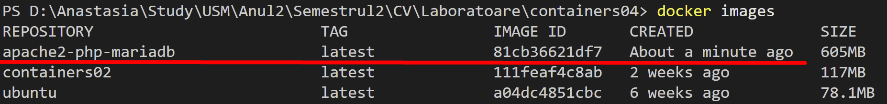
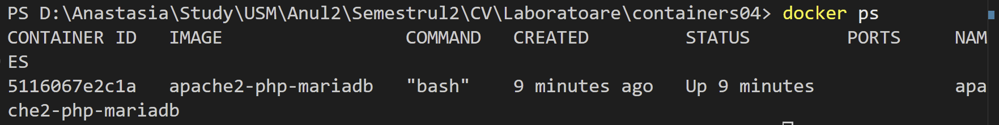
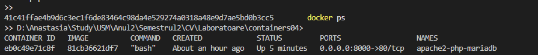
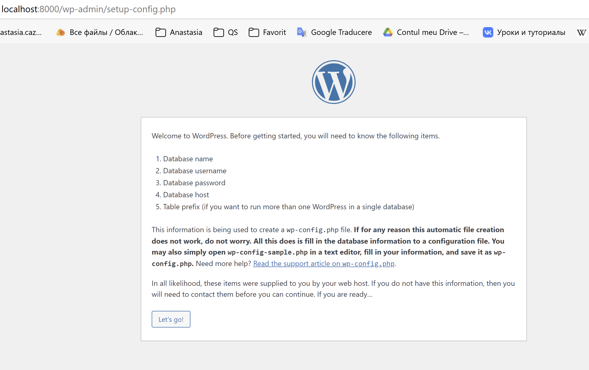
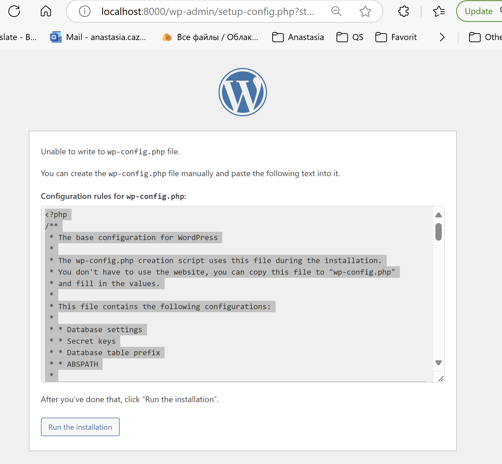
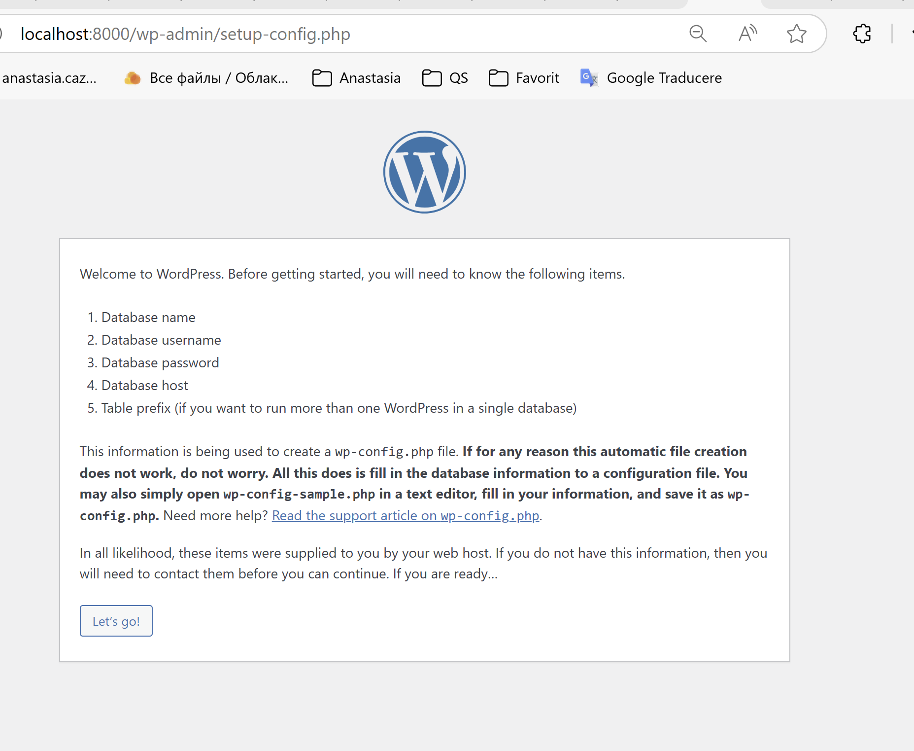

# containers04

## Scopul lucrării

Pregătirea uni container pentru a rula un site web bazat pe Apache HTTP Server + PHP (mod_php) + MariaDB.

## Sarcina

Am creat un fișier Dockerfile pentru a construi o imagine a containerului care conține un site web bazat pe Apache HTTP Server + PHP (mod_php) + MariaDB. Baza de date MariaDB este stocată într-un volum montat. Serverul trebuie este disponibil pe portul 8000.
Am instalat site-ul WordPress.

## Descrierea executării lucrării

### Descrierea lucrului cu Git-ul

1. M-am conectat la contul meu de GitHub.
2. Am dat click pe "New repository".
3. Am denumit repository-ul, am bifat să fie inițializat cu un fișier nou `README.md` și l-am creat.
4. Am clonat repository-ul în Visual Studio (VS) Code:
   - `git clone https://github.com/anastasiaCazacu/containers04.git` - clonez repository-ul.
   - `cd containers04` - accesez folderul clonat.
   - `git checkout -B lab04` - creez branchiul si ma mut pe el si modific fisierul meu README.MD si ulterior doar adaug continutul.
   - `git add *` - adaug tot continutul.
   - `git status` - verific statutul si ma asigur ca am modificarile dorite.
   - `git commit -m "structure defined"` - creez commitul
   - `git push origin lab04` - push commit în depozitul de la distanță
   - `git checkout main`- Comut pe branch-ul principal
   - `git merge lab04`- Integrez (merge) branch-ul nou în main.
   - `git push origin main` - Împing schimbările pe GitHub.

### Execuția

Vom executa următorii pași:

1. Extragerea fișierelor de configurare apache2, php, mariadb din container:

   a. creez in directorul containers04 un director **files** cu directorul **files/apache2** - pentru fișierele de configurare apache2, directorul **files/php** - pentru fișierele de configurare php, directorul **files/mariadb** - pentru fișierele de configurare mariadb cu `mkdir -p files/apache2 files/php files/mariadb
`.

   b. Crez în directorul containers04 fișierul Dockerfile cu continutul propus.

   c. Pornesc Dockerul. Deschid in directiva unde se afla Dockerfile.Rulez comanda `docker build -t apache2-php-mariadb .` pentru a crea imaginea cu numele **apache2-php-mariadb**. unde `-t` specifica numele etichetei a imaginii. Iar punctul- directorul curent si ale fisierelor necesare.

   d. Dupa finisare verific daca exista imaginea cu `docker image`
   

   e. crearea de container cu numele **apache2-php-mariadb** cu `docker run -dit --name apache2-php-mariadb apache2-php-mariadb bash`. Astfel cu **docker run** va crea si va porni un container. Caracterele `-d`-ruleaza in fundal containerul. `i`- pastreaza păstrează intrarea standard deschisă pentru interactivitate. `t`- creează un pseudo-terminal pentru ca aplicațiile din container să creadă că rulează într-un terminal real. `--name apache2-php-mariadb`-atribui nume containerului ,`apache2-php-mariadb`- imaginea folosita ,`bash`- comanda care se va rula dupa pornirea containerului. Aici se deschide un shell bash. Rezultatul este `5116067e2c1ae1cb7ddac8438178833ab478981a3abee39ffda48f5f815a81db`-hash-ul afisat. Ruland comanda creaza si porneste containerul apache2-php-mariadb, care a avut loc cu succes iar has-ul este id-ul unic al containerului.

   f. cu `docker ps`- verific daca dockerul ruleaza: 

   g. Copiez din container fișierele de configurare apache2, php, mariadb în directorul files/ de pe computer. cu comenzele propuse: ```bash
docker cp apache2-php-mariadb:/etc/apache2/sites-available/000-default.conf files/apache2/
docker cp apache2-php-mariadb:/etc/apache2/apache2.conf files/apache2/
docker cp apache2-php-mariadb:/etc/php/8.2/apache2/php.ini files/php/
docker cp apache2-php-mariadb:/etc/mysql/mariadb.conf.d/50-server.cnf files/mariadb/```. Verific continutul si el ezista trec la sarcina urmatoare.

   h. Opresc containerului `docker stop apache2-php-mariadb`. Sterg containerul cu `docker rm apache2-php-mariadb`. verific daca exista containerul daca exista cu `docker ps -a`.

2. Configurarea fișierul de configurare apache2:

   a. Deschid fișierul files/apache2/000-default.conf, găsesc linia `#ServerName www.example.com` și o înlocuesc cu `ServerName localhost`.

   b. Inlocuiesc cu `ServerAdmin webmaster@localhost` - inlocuesc webmaster@localhost- cu adresa mea.

   c. Adaug `DirectoryIndex index.php index.html` dupa linia `DocumentRoot /var/www/html`. Salvez si inchid fisierul.

   d. La sfârșitul fișierului files/apache2/apache2.conf adaug următoarea linie: `ServerName localhost`.

3. Fișierul de configurare php

   a. In fișierul `files/php/php.ini`,  linia `;error_log = php_errors.log` și înlocuiesc cu `error_log = /var/log/php_errors.log`.

   b. Setez parametrii `memory_limit, upload_max_filesize, post_max_size` și `max_execution_time` astfel:```
memory_limit = 128M
upload_max_filesize = 128M
post_max_size = 128M
max_execution_time = 120```. Salvez fișierul și închid. Aceste setări vor ajusta performanța PHP pentru a se potrivi cerințelor.

4. Fișierul de configurare mariadb

   a. Deschid fișierul `files/mariadb/50-server.cnf`, găsesc linia `#log_error = /var/log/mysql/error.log` și eliminați `#` din fața ei.

   b. Salvez fișierul și închid.

5. Crearea scriptului de pornire

   a. In directorul files creez directorul `supervisor` si fisierul `supervisord.conf` cu continutul propus.

6. Crearea Dockerfile

   a. Dockerfile arata in felul urmator dupa cerinte:

   ```# create from debian image
      FROM debian:latest
   # mount volume for mysql data
   VOLUME /var/lib/mysql

   # mount volume for logs
   VOLUME /var/log

   # install apache2, php, mod_php for apache2, php-mysql and mariadb
   RUN apt-get update && \
      apt-get install -y apache2 php libapache2-mod-php php-mysql mariadb-server supervisor && \
      apt-get clean

   # RUN apt-get update && \
   #     apt-get install -y apache2 php libapache2-mod-php php-mysql mariadb-server && \
   #     apt-get clean

   # add wordpress files to /var/www/html
   ADD https://wordpress.org/latest.tar.gz /var/www/html/

   # copy the configuration file for apache2 from files/ directory
   COPY files/apache2/000-default.conf /etc/apache2/sites-available/000-default.conf
   COPY files/apache2/apache2.conf /etc/apache2/apache2.conf

   # copy the configuration file for php from files/ directory
   COPY files/php/php.ini /etc/php/8.2/apache2/php.ini

   # copy the configuration file for mysql from files/ directory
   COPY files/mariadb/50-server.cnf /etc/mysql/mariadb.conf.d/50-server.cnf

   # copy the supervisor configuration file
   COPY files/supervisor/supervisord.conf /etc/supervisor/supervisord.conf

   # create mysql socket directory
   RUN mkdir /var/run/mysqld && chown mysql:mysql /var/run/mysqld

   EXPOSE 80

   # start supervisor
   CMD ["/usr/bin/supervisord", "-n", "-c", "/etc/supervisor/conf.d/supervisord.conf"]
   ```

   a. Rulez următoarea comandă pentru a construi imaginea `apache2-php-mariadb` din fișierul `Dockerfile` cu `docker build -t apache2-php-mariadb .`

   b. Lansez un container nou din imaginea creată, mapând portul 8000 cu `docker run -dit --name apache2-php-mariadb -p 8000:80 apache2-php-mariadb
` raspunsul `eb0c49e71c8f336f887188108e65ff4620de81e6d127971240e4d348cf286d96`


   c. Verificarea site-ului WordPress
Deschid un browser web și accesați <http://localhost:8000/>. .

7. Am creat bazelor de date și a utilizatorului pentru WordPress

8. Crearea fișierului de configurare WordPress


9. Am adaugat fișierului de configurare WordPress în Dockerfile

10. Pornesc și testez

   a. rulez `docker build -t apache2-php-mariadb .`- Recreaz imaginea Docker

   b. `docker stop apache2-php-mariadb`, `docker rm apache2-php-mariadb` - sterg containerul existent

   c. `docker run -dit --name apache2-php-mariadb -p 8000:80 apache2-php-mariadb` - pornesc un nnou container


## Răspunsuri la întrebări

1. Ce fișiere de configurare au fost modificate? `/etc/apache2/sites-available/000-default.conf`, `/etc/supervisor/conf.d/supervisord.conf`- Pentru a gestiona pornirea și supravegherea serviciilor (Apache și MariaDB) în interiorul containerului Docker. `/etc/php/8.2/apache2/php.ini`- Pentru a ajusta limitele de memorie, dimensiunile fișierelor încărcate. `wp-config.php`- Fișierul specific WordPress care conține informațiile necesare pentru conectarea la baza de date.

2. Pentru ce este responsabilă instrucția DirectoryIndex din fișierul de configurare Apache? Instrucțiunea DirectoryIndex definește fișierul implicit servit atunci când un utilizator accesează o adresă URL care nu specifică un fișier.

3. De ce este necesar fișierul wp-config.php? Fișierul wp-config.php este esențial pentru configurarea WordPress. Prefixul tabelelor bazei de date `($table_prefix)`. Cheile de securitate și săruri `(AUTH_KEY, SECURE_AUTH_KEY, etc.)`.
Setări avansate precum modul de depanare (WP_DEBUG). Fără acest fișier, WordPress nu poate stabili conexiunea la baza de date necesară pentru funcționarea sa.

4. Pentru ce este responsabil parametrul `post_max_size` din fișierul de configurare PHP? Definește dimensiunea maximă a datelor transmise printr-o cerere HTTP POST.

5. Deficiențele imaginii containerului creat.
   În opinia mea, există câteva posibile deficiențe:

Fiabilitatea configurației:

Lipsa inițială a fișierului supervisord.conf și a unei configurări automate.

Dimensiunea imaginii:

Instalarea pachetelor necesare, cum ar fi MariaDB, Apache și PHP, într-o singură imagine poate duce la o imagine voluminoasă.

Lipsa modularizării:

Containerul folosește atât Apache cât și MariaDB în același container, ceea ce contravine bunelor practici Docker (un container pentru un serviciu).

Depanare limitată:

Configurația inițială necesită ajustări manuale (precum fișiere lipsă), ceea ce complică utilizarea pentru cei neexperimentați.

Lipsa unui mecanism pentru actualizări automate:

Imaginea nu pare să gestioneze actualizările WordPress sau ale dependențelor sale.

## Concluzii

Succes în configurarea WordPress: Site-ul WordPress a fost implementat și configurat corect, iar problemele principale (precum conexiunea la baza de date și fișierele lipsă) au fost soluționate. Rezultatul final: Site-ul WordPress este funcțional și configurat cu succes pe baza soluțiilor implementate.
